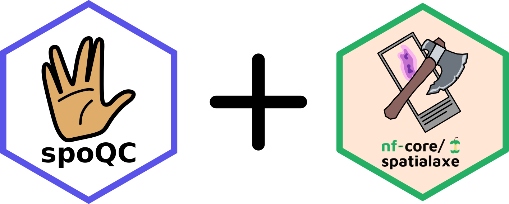

# spoQC

[](https://github.com/heylf/spoQC_beta/actions/workflows/ci.yml)
[](https://www.docker.com/)
[](https://sylabs.io/docs/)
[](https://nfcore.slack.com/channels/spatialaxe)


<div style="height: 20px;"></div>

spoQC is a modular framework for multimodal quality control (QC) of imaging-based spatially resolved transcriptomics (SRT). It independently evaluates cell segmentation, imaging, and transcript data to identify high-quality regions (HQRs) across entire tissue sections. In addition, spoQC uses Markov random fields (MRFs) to incorporate spatial dependencies and generate spatially refined QC masks.

> [!NOTE]
SpoQC is currently under active development and is still in the alpha phase. You may encounter bugs, incomplete features, or unexpected behavior. If you are testing spoQC and run into any issues, please contact the development team or open an issue in the repository. Feedback, bug reports, and pull requests are highly appreciated and help us improve the project.

> [!NOTE]
Processing a full-resolution spatial transcriptomics (SRT) dataset with spoQC typically requires access to an HPC (High Performance Computing) environment. For smaller datasets, reduced-resolution data, or data subsets, it may be possible to run spoQC locally.



To reduce runtime and improve scalability, we recommend running spoQC with Nextflow. We are continuously working on improving performance and making local execution easier.

# Supported Spatial Transcriptomics Technologies

Currently supported:

- 10x Xenium

> [!NOTE]
Atera support is currently under development and is not yet available.

# Cite

If you use spoQC in your work, please cite:

> Citation information will be provided soon.

# Collaborators

This tool was developed in collaboration with the following institutions:

- German Cancer Research Center (DKFZ, Heidelberg, Germany)
- Centro Nacional de Análisis Genómico (CNAG, Barcelona, Spain)
- Center for Quantitative Analysis of Molecular and Cellular Biosystems (BioQuant, Heidelberg, Germany)
- Berlin Institute of Health at Charité (Berlin, Germany)
- Altos Labs San Diego Institute of Technology (San Diego, USA)
- Allen Institute for Brain Science (Seattle, USA)
- European Molecular Biology Laboratory (EMBL, Heidelberg, Germany)

# Contributors

The following people contributed directly or indirectly through supervision, code review, and the development of concepts and ideas:

- Florian Heyl
- Ezgi Sen
- Niklas Müller-Bötticher
- Sameesh Kher
- Dongze He
- Brian Long
- Naveed Ishaque
- Oliver Stegle

# Documentation

For further details please read the [documentation](https://spoqc.readthedocs.io/en/latest/).


# Installation

## Docker

```
docker run -ti quay.io/heylf/spoqc:0.1.0
```

## Pip

```
pip install spoqc
```

# Run

spoQC is designed to process large spatial transcriptomics (SRT) datasets at full resolution. Running the complete pipeline typically requires access to an HPC (High Performance Computing) environment.

If you do not have access to an HPC system, you may still be able to run spoQC locally by:

- Using a lower-resolution dataset.
- Running spoQC on a subset of your data.
- Testing individual pipeline steps before processing the full dataset.

## Step 1: Generate a Cell Type Annotation (Optional)

If your dataset does not already contain a cell type annotation, spoQC can create one automatically using unsupervised Leiden clustering.

Run:

```bash
python3 -m spoqc -s "annotation" -i [input_spatial_data_bundle] -o [output_folder] -t [spoqc_tmp_folder] -n [n_cores]
```

After the analysis finishes, spoQC will create an annotation file:

```text
[spoqc_tmp_folder]/report/annotation/unsupervised_cell_annotation.tsv
```

You can use this file as the value for the `[annotation_file]` parameter in later steps.

---

## Step 2: Run the Complete spoQC Pipeline

To execute all spoQC analyses in the correct order, run:

```bash
python3 -m spoqc -s all -i [input_spatial_data_bundle] -o [output_folder] -t [spoqc_tmp_folder] -n [n_cores] -a [annotation_file]
```

This is the recommended option for most users.

---

## Step 3: Run Individual Pipeline Steps

Advanced users can execute individual spoQC steps separately.

Run:

```bash
python3 -m spoqc -s [step] -i [input_spatial_data_bundle] -o [output_folder] -t [spoqc_tmp_folder] -n [n_cores] -a [annotation_file]
```

Replace `[step]` with one of the following pipeline stages.

> **Important:** These steps must be executed in the exact order shown below. Running steps out of order will cause downstream analyses to fail.

1. generalqc
2. bubbleqc
3. doubletqc
4. voidqc
5. cellqc
6. ambientqc
7. hqcr_ident
8. hqcr_celltype
9. hqpr_metrices (has to be run for each staining)
10. hqpr_clustering (has to be run for each staining)
11. hqpr_refinement (has to be run for each staining)
12. hqpr_bounding_box (has to be run for each staining)
13. hqpr_celltype (has to be run for each staining)
14. hqtr_metrices
15. hqtr_ac
16. hqtr_qv
17. hqtr_clustering
18. hqtr_refinement
19. hqtr_bounding_box
20. hqtr_celltype
21. combine_masks (has to be run for each staining)
22. transcriptqc
23. modelqc
24. cellcycleqc
25. analysis_overview
26. analysis_cluster
27. analysis_category

### Example

To run the first pipeline step (`generalqc`), execute:

```bash
python3 -m spoqc -s generalqc -i [input_spatial_data_bundle] -o [output_folder] -t [spoqc_tmp_folder] -n [n_cores] -a [annotation_file]
```

Wait until the step has completed successfully before continuing with the next step in the list.

# Nextflow subworkflow


spoQC can be executed sequentially, but processing a full-resolution spatial transcriptomics dataset typically takes **4–5 days** to complete.

To significantly reduce runtime, we provide a dedicated Nextflow subworkflow that parallelizes many of the processing steps. Using the Nextflow workflow can reduce the total runtime to approximately **1–2 days**, depending on the available computational resources.

The workflow is available on the **spoQC branch** of [nf-core/spatialaxe](https://github.com/nf-core/spatialaxe/tree/dev).

> [!NOTE]
Processing a full-resolution spatial transcriptomics (SRT) dataset with spoQC typically requires access to an HPC (High Performance Computing) environment.

If an HPC system is not available, you may still be able to run spoQC locally by:

- Using a lower-resolution dataset.
- Processing a subset of your data.
- Running selected workflow components instead of the complete pipeline.

# Contribute

There are several ways to contribute to spoQC. The project is built around four main pillars:

- metrics
- priors
- subworkflows
- standard pre- and postprocessing scripts

> [!NOTE]
We are currently working on standardizing these components and providing templates to make contributions easier and more consistent.

## `spoqc/metrics/`

Metrics are used to quantify different aspects of spatial transcriptomics data quality. Currently, metrics are organized into three categories:

- image metrics
- segmentation metrics
- transcript density metrics

Some metrics may be relevant to multiple categories. The organization of these layers is still being refined as spoQC evolves.

### Examples

**Segmentation metric**

`spoqc/metrics/segmentation/overlap_area.py`

Segmentation metrics must be linked back to individual cells and stored in the SpatialData object (within the associated AnnData table).

**Image metric**

`spoqc/metrics/image/edge_strength.py`

Image metrics should be saved as a one-dimensional (1D) array.

**Transcript density metric**

`spoqc/metrics/image/transcript_density_image.py`

Transcript density metrics should also be saved as a one-dimensional (1D) array.

## `spoqc/priors/`

Priors are used to estimate the initial probability that a spatial observation (for example, a cell or pixel) is of high or low quality based on a specific metric.

All priors are combined in:

```
spoqc/priors/combine_priors.py
```

Each prior contributes evidence about the quality of a spatial observation and is integrated into the overall quality assessment.

## `spoqc/subworkflows/`

SpoQC contains several predefined subworkflows that automate common analysis tasks.

Some subworkflows, such as `qc_doublets.py`, serve as entry points for metric calculation, quality assessment, visualization, and reporting.

Subworkflows are a good place to contribute additional analysis pipelines or improve existing workflows.

## Standard Pre- and Postprocessing Scripts

SpoQC also includes scripts for common preprocessing and postprocessing operations.

Examples include:

- normalization methods
- data transformations
- filtering procedures
- result aggregation and reporting

Contributions that improve interoperability with new data formats or analysis workflows are particularly welcome.

## How to Add a New Metric

To contribute a new metric, follow these steps:

1. Identify which metric category the new metric belongs to (image, segmentation, transcript density, or another relevant layer).
2. Implement the metric calculation and place the script in the appropriate folder under:

   ```
   spoqc/metrics/
   ```

3. Create a corresponding prior estimation method and place it in:

   ```
   spoqc/priors/
   ```

4. Register the new prior in:

   ```
   spoqc/priors/combine_priors.py
   ```

5. Ensure that the prior returns the probability that a spatial observation (for example, a cell or pixel) is of **high quality**.

### Checklist for New Metrics

- [ ] Metric implementation added to `spoqc/metrics/`
- [ ] Metric output stored in the expected format
- [ ] Prior implementation added to `spoqc/priors/`
- [ ] Prior registered in `spoqc/priors/combine_priors.py`
- [ ] Prior represents the probability of high-quality observations
- [ ] Documentation and examples added where appropriate


