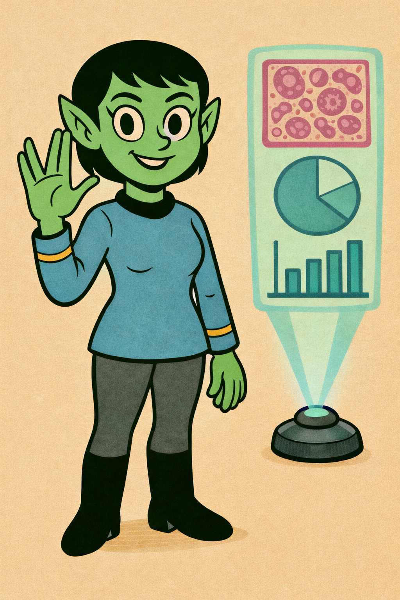
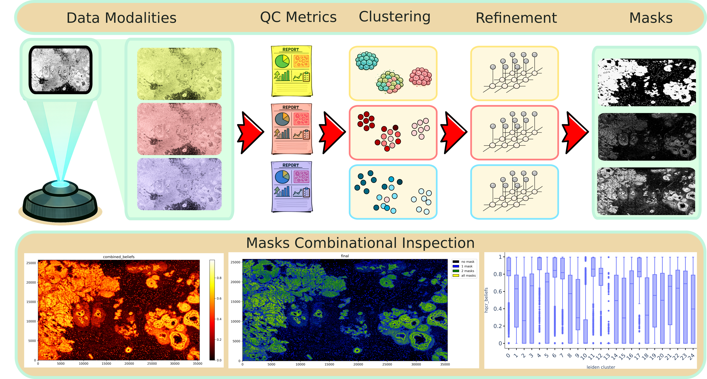

# spoQC

[](https://rewrites.bio)



> [!NOTE]
> :bangbang: SpoQC is under active developement and still in apha phase. You will experience lots of issues. If you are an alpha tester and run into problems please contact us or write an issue. We are happy to receive feeback and PRs to improve spoQC. :bangbang:

Currently this code is under private usage. It is not allowed to distrbute or publish it. If you are invited to work on this project then please keep a copy/fork of this repo private.



# Installation

## Docker

```
docker run -ti heylf/spoqc:0.1.0
```

## Python

```
pip install spoqc
```

# Supported spatial transcriptomics technologies

* 10x Xenium

> [!NOTE]
> CosMx: We currently working on to support this data. 

# Input

* [Input formats](docs/input.md)

# Output

* [Plots and report explanations](docs/output_report.md)
* [SpoQC tmp data files](docs/output_tmp.md)

# Nextflow subworkflow

You can use the tool sequential, but it will take 4-5 days to complete everything. In order to speed things up, we provide a nextflow subworkflow that will reduce the time to 1-2 days. You can find the subworkflow under [nf-core/spatialxe](https://github.com/nf-core/spatialxe/tree/dev) in the spoQC branch. SpoQC needs an HPC infrastructure to perform all task on a full SRT datset with full resolution. You might be able to perform spoQC locally with a lower resolution or with subsetting your data.

> [!NOTE]
> We are developing a Nextflow SRT QC sub-workflow repository to support all technologies. If new data modalities are added to spoQC they will also be present in this repository: [soon to come]().

# Executing spoQC pipeline via python (sequential)

SpoQC needs an HPC infrastructure to perform all task on a full SRT datset with full resolution. You might be able to perform spoQC locally with a lower resolution or with subsetting your data.

## Annotation

Optional step if you do not have a cell type annotation yet, then spoQC can do an analysis using an unsupervised (Leiden) clustering.

```
python3 -m spoqc -s "annotation" -i [input_spatial_data_bundle] -o [output_folder] -t [spoqc_tmp_folder] -n [n_cores]
```

This will generate you an annotation file in spoQC format `[spoqc_tmp_folder]/report/annotation/unsupervised_cell_annotation.tsv`

## Execute everything in spoQC

You can execute spoQC completly with:

```
python3 -m spoqc -s all -i [input_spatial_data_bundle] -o [output_folder] -t [spoqc_tmp_folder] -n [n_cores] -a [annotation_file]
```


## Individual step execution

You can execute spoQC for each step individually with:

```
python3 -m spoqc -s [step] -i [input_spatial_data_bundle] -o [output_folder] -t [spoqc_tmp_folder] -n [n_cores] -a [annotation_file]
```

with [step] in the following order (if you do not follow this order things will break):

* generalqc
* bubbleqc
* doubletqc
* voidqc
* cellqc
* ambientqc
* hqcr_ident
* hqcr_celltype
* hqpr_metrices
* hqpr_clustering
* hqpr_clustering
* hqpr_refinement
* hqpr_bounding_box
* hqpr_celltype
* hqtr_metrices
* hqtr_ac
* hqtr_qv
* hqtr_clustering
* hqtr_refinement
* hqtr_bounding_box
* hqtr_celltype
* combine_masks
* transcriptqc
* modelqc
* cellcycleqc
* analysis_overview
* analysis_cluster
* analysis_category

For example for the first step you execute the command:

```
python3 -m spoqc -s generalqc -i [input_spatial_data_bundle] -o [output_folder] -t [spoqc_tmp_folder] -n [n_cores] -a [annotation_file]
```

# AI usage

We used AI for the following scripts:

* `markov_random_field_zarr.py` and `markov_random_field_zarr_parallel.py`
    * an intial version was written `markov_random_field.py` by hand
    * the first version was then optimized (for runtime and memory) by AI leading to the aforementioned scripts
    * correctness of AI implementation (optization) was done by equal comparison of the results between human and AI implementation
* `image_metrices.py`
    * several metrics were written by AI
    * correctness of AI implementation (optization) was done by equal comparison of the results between human and AI implementation
* `pixel_scoring_dask.py`
    * an intial version was written by hand
    * the first version was then optimized (for runtime and memory) by AI leading to the aforementioned scripts
* `Dockerfile`
    * Dockerfile was intially written by AI and optimized by hand
* AI added to many scripts docstrings and type hints