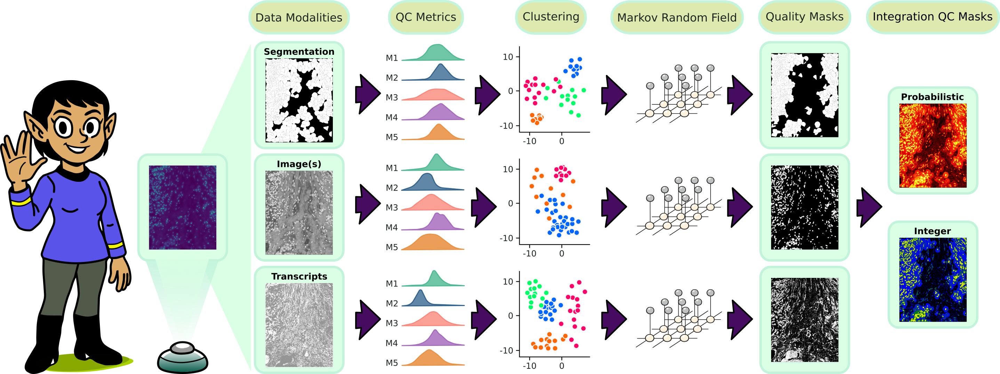

# spoQC

[](https://rewrites.bio)



> [!NOTE]
SpoQC is under active developement and still in apha phase. You will experience lots of issues. If you are an alpha tester and run into problems please contact us or write an issue. We are happy to receive feeback and PRs to improve spoQC.

> [!NOTE]
SpoQC needs an HPC infrastructure to perform all tasks on a full SRT datset with full resolution. You might be able to perform spoQC locally with a lower resolution or with subsetting your data. In order to reduce runtime please check out how to run spoQC with Nextflow. We are continously to improve the performance for spoQC to support an easier local usage.

Currently this code is under private usage. It is not allowed to distrbute or publish it. If you are invited to work on this project then please keep a copy/fork of this repo private.

You want to contribute to spoQC or reuse some of our code then checkout [how to contribute to spoQC](#contribute).

# Cite

IF you use spoQC then please cite:

# Supported spatial transcriptomics technologies

* 10x Xenium

> [!NOTE]
Atera: We currently working to support this data.

# Documentation

For further details please read the [documentation]().

# Installation

## Docker

```
docker run -ti heylf/spoqc:0.1.0
```

## Pip

```
pip install spoqc
```

# Run
Executing spoQC pipeline via python (sequential):

SpoQC needs an HPC infrastructure to perform all task on a full SRT datset with full resolution. You might be able to perform spoQC locally with a lower resolution or with subsetting your data.

## Annotation

Optional step if you do not have a cell type annotation yet, then spoQC can do an analysis using an unsupervised (Leiden) clustering.

```
python3 -m spoqc -s "annotation" -i [input_spatial_data_bundle] -o [output_folder] -t [spoqc_tmp_folder] -n [n_cores]
```

This will generate you an annotation file in spoQC format `[spoqc_tmp_folder]/report/annotation/unsupervised_cell_annotation.tsv`

## Execute everything in spoQC

You can execute spoQC completly with:

```
python3 -m spoqc -s all -i [input_spatial_data_bundle] -o [output_folder] -t [spoqc_tmp_folder] -n [n_cores] -a [annotation_file]
```


## Individual step execution

You can execute spoQC for each step individually with:

```
python3 -m spoqc -s [step] -i [input_spatial_data_bundle] -o [output_folder] -t [spoqc_tmp_folder] -n [n_cores] -a [annotation_file]
```

with [step] in the following order (if you do not follow this order things will break):

* generalqc
* bubbleqc
* doubletqc
* voidqc
* cellqc
* ambientqc
* hqcr_ident
* hqcr_celltype
* hqpr_metrices
* hqpr_clustering
* hqpr_clustering
* hqpr_refinement
* hqpr_bounding_box
* hqpr_celltype
* hqtr_metrices
* hqtr_ac
* hqtr_qv
* hqtr_clustering
* hqtr_refinement
* hqtr_bounding_box
* hqtr_celltype
* combine_masks
* transcriptqc
* modelqc
* cellcycleqc
* analysis_overview
* analysis_cluster
* analysis_category

For example for the first step you execute the command:

```
python3 -m spoqc -s generalqc -i [input_spatial_data_bundle] -o [output_folder] -t [spoqc_tmp_folder] -n [n_cores] -a [annotation_file]
```

# Contribute

SpoQC has four important pillars.

- metrics
- priors
- subworkflows
- standard pre- and postprocessing scripts

> [!NOTE]
> We are working to standardize these pillars to be able to provide templates to make contribution easier.

## spoqc/metrics/

Metrics are currently split into image, segmentation and transcript density relevant. We want to stress out, that some metrics might overlap with other modalities. We are currently still optimizing the layers of spoQC.

Examples:
- segmentation metrics example: `spoqc/metrics/segmentation/overlap_area.py`. The metric has to be linked back to the cell and it needs to be saved in the SpatialData object (in the anndata).
- image metrics example: `spoqc/metrics/image/edge_strength.py`. The metric should be saved as a 1D matrix.
- transcript density metrics example: `spoqc/metrics/image/transcript_density_image.py`. The metric should be saved as a 1D matrix.

## spoqc/priors/

Prior code is used in order to estimate an initial prior for the defined metric for bad (good) spatial observations (e.g., pixel). Priors are combined in the script `spoqc/priors/combine_priors.py`.

## spoqc/subworkflows/

SpoQC has predefined subworkflows for various tasks. Some workflows, such as `qc_doublets.py`, are used to start the data processing and plotting for metrics.

## standard pre- and postprocessing scripts

SpoQC has also scripts for various data pre- and postprocessing steps, such as normalizations.

## How to provide a new metric?

1. First identify into which layer the metric falls.
2. Write an individual script for the calculation of the metric and place it in the `spoqc/metrics`.
3. Write a prior estimation for the individual metric and place it in the `spoqc/priors` folder.
4. Add the prior to the `spoqc/priors/combine_priors.py` script. Each prior has to represent the prbability of the good quality of the spatial observation (e.g., cell or pixel).


