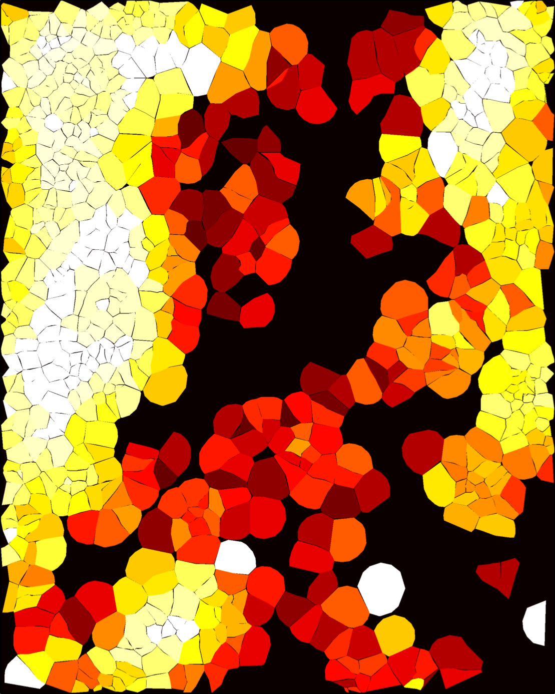

# Segmentation (cell) metrics

Glossary of all metrics used for the high-quality cell region (HQCR).

SpoQC currently computes the following QC metrics from the single cell and cell segmentation data:

- cell-area–normalized transcript counts
- control probe counts (based on Xenium control probes)
- cell-area–normalized gene counts
- cell convexity
- minimum nuclear convexity per cell (cells may contain multiple nuclei)
- number of nuclei per cell
- border score
- thinness (bubble) score
- island score
- area of overlap with other cell polygons
- number of transcripts located within the cell convex hull but not assigned to the cell (uRNAs within convex hull)
- number of low-quality transcripts (QV < 20)
- doublet distance using [ovrl.py](https://github.com/HiDiHlabs/ovrl.py)

## Convexity

The convexity of a cell or nucleus has values in the range of $[0,1]$, where $1$ represents a fully convex polygon.

## Thinness (bubble) score

The thinness score evaluates whether a cell polygon approximates a circular “bubble” shape. It is defined as:

$$
T = \frac{4 \pi A}{P^2}
$$

where $A$ is the cell area and $P$ is the polygon perimeter (circumference). Values close to $1$ indicate a highly circular shape.

## Border score

The border score measures whether a cell is located at a physical boundary, such as the edge of the slide or the interface between tissue domains. The score takes values in $[0,\infty)$, where larger values indicate a higher likelihood of being a border cell. In our datasets, values typically range between $0$ and $7$.

**Computation:**

1. For a given cell, all neighboring cells within a circular radius are identified.
2. The log-ratio between the number of neighbors on opposite sides of the cell is calculated:

   $$
   \log_2\left(\frac{N_{\text{left}}}{N_{\text{right}}}\right)
   $$

3. Because tissue borders are not necessarily aligned with Cartesian axes, the neighborhood is rotated (using a rotation matrix) around the central cell.
4. The log-ratio is computed for multiple rotation angles between $0^\circ$ and $360^\circ$.
5. The maximum log-ratio across all orientations is defined as the border score.

## Island score

The island score measures how isolated a cell is within the tissue, identifying regions with weak connectivity, or in an extreme case, single cells.

**Computation:**

1. A *k*-d tree is constructed from cell centroids.
2. Using a fixed distance threshold, an iterative connected-component search is performed:
   - For each cell, neighboring cells within the threshold are identified.
   - Neighbors that themselves have neighbors within the threshold are recursively added to the group.
   - The process continues until the component boundary is reached.
3. Each connected component contains a certain number of cells.
4. This component size is assigned to every cell in the component and defined as its island score.

Small island scores indicate isolated or weakly connected cells, whereas large scores indicate dense tissue regions.