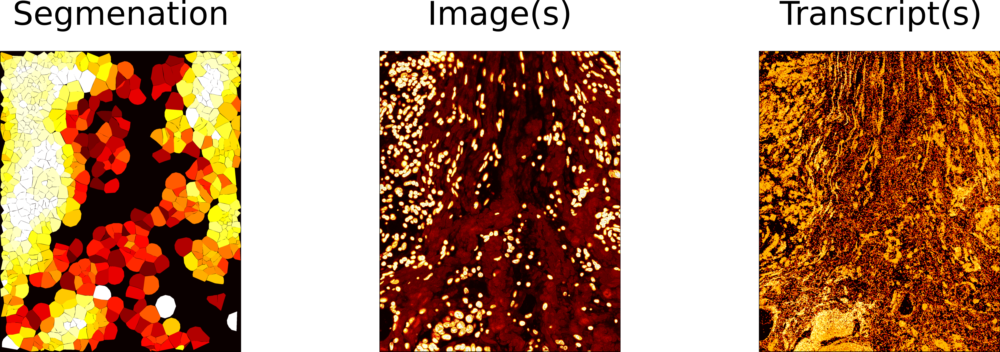

# Metrics glossary

Glossary of all metrics computed by spoQC, grouped by layer.



<div style="height: 20px;"></div>

```{toctree}
:maxdepth: 1

metrics_cell_layer.md
metrics_image_layer.md
metrics_transcript_layer.md
```
