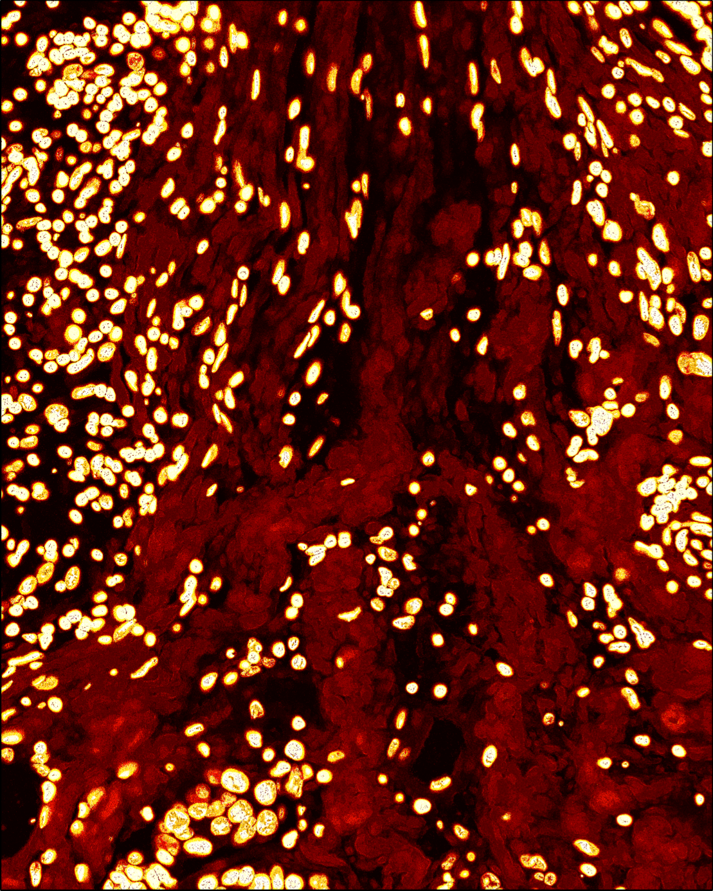

# Image (staining) metrics

Glossary of all metrics used for the high-quality pixel region (HQPR).

SpoQC evaluates the information content of individual pixels and computes several imaging-based metrics that indicate whether a pixel is likely to belong to biologically relevant structures rather than background or noise. The following metrics are computed for both the staining images (pixel-level features) and the transcript-density image.

## Edge strength

Edge strength quantifies the likelihood that a pixel lies on a structural boundary. Edges in an image correspond to locations where the local intensity gradient is large relative to neighboring pixels. Higher values indicate stronger local boundaries.

**Computation:**

1. Spatial gradients in the x and y directions are computed using Sobel filters.
2. The gradient magnitude of the intensities $I$ is calculated, where a logarithmic transform stabilizes the dynamic range:

$$
\text{Edge strength} = \log_{10}\left(\sqrt{(\nabla_x I)^2 + (\nabla_y I)^2} + 1\right)
$$

## Energy

Pixel energy measures whether an intensity signal persists after local smoothing. The metric evaluates whether a pixel represents consistent structure or a single-pixel outlier in a noisy homogeneous region.

**Computation:**

1. Intensities are squared.
2. A Gaussian filter ($\sigma = 1$) is applied within a defined window radius.
3. The log-transformed filtered value is reported.

Pixels belonging to stable structures retain high energy after smoothing, whereas isolated noisy pixels lose intensity.

## Relevance

Relevance is derived from the energy metric but converted into a binary mask using Otsu thresholding. It therefore classifies pixels as either structurally relevant or background.

## Entropy

Local entropy measures the variability of pixel intensities within a defined window centered at each pixel. High entropy indicates heterogeneous regions (e.g., texture or structural detail), while low entropy indicates uniform background.

## Uniformity

Uniformity quantifies how close the local intensity distribution is to random noise. It is defined as the Kullback–Leibler divergence between the window intensity distribution and a uniform distribution.

## Homogeneity

Homogeneity measures local similarity of pixel intensities. For a window centered at pixel $i$, the metric evaluates the absolute differences between the center pixel and surrounding pixels. Values close to 1 represent a highly homogeneous region, whereas low values indicate a heterogeneous region. Conceptually, this metric complements uniformity but uses direct intensity differences rather than a probabilistic comparison.