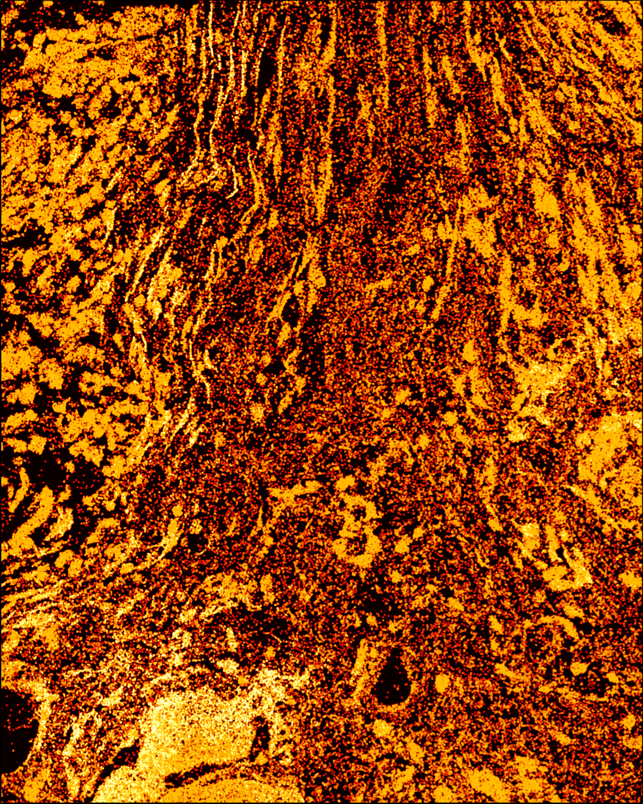

# Transript (density) metrics

Glossary of all metrics used for the high-quality transcript region (HQTR).

## Transcript-density image

To generate the transcript-density image, spoQC performs the following steps:

1. **Coordinate transformation:** Transcript coordinates (in microns) are converted into pixel coordinates using the same image dimensions as the staining images at a chosen resolution. spoQC is applied using the highest available resolution.
2. **Pixel transcript assignment:** A pixel represents a sampled measurement of a physical area determined by the optical resolution ([Smith, 1995](https://www.cs.princeton.edu/courses/archive/fall24/cos426/cos426assets/static/readings/Smith95b.pdf)). Consequently, multiple transcripts may fall within a single pixel. SpoQC therefore counts, for each pixel, the number of transcripts whose coordinates overlap that pixel. Pixels without transcripts are assigned a count of zero.
3. **Density estimation via convolution:** The resulting image is typically too sparse for reliable imaging-based metric analysis. To obtain a continuous signal, spoQC applies a circular binary kernel with a defined radius of $3$ pixels (Euclidean distance). We have selected a circular kernel because a pixel is technically not a square ([Smith, 1995](https://www.cs.princeton.edu/courses/archive/fall24/cos426/cos426assets/static/readings/Smith95b.pdf)), and a circular reconstruction filter might be a better representation. The kernel is convolved with the transcript count image to compute a local transcript density at each pixel position, referred to as the transcript-density image. Convolution is performed using `scipy.ndimage.convolve` with `mode='constant'` and `cval=0`, which pads the image outside its boundaries with zeros.

## Transcript-quality image

The transcript-quality image, here termed the transcript QV image, is generated analogously to the transcript-density image. The naming follows the Xenium terminology, where QV (Phred-scaled quality value, Q-score) estimates the probability of an incorrect transcript call.

Two differences distinguish this image from the transcript-density image:

1. **Pixel values:** Instead of transcript counts, each pixel stores quality information.
2. **Aggregation method:** For each pixel, rather than counting transcripts, spoQC computes the mean QV of all transcripts whose coordinates overlap the pixel. Pixels without transcripts are assigned a value of zero.

## Transcript autocorrelation image

SpoQC estimates potential RNA contamination by quantifying spatial autocorrelation at both global and local scales. For each pixel, a combined autocorrelation value is derived from transcript-level Moran's *I* statistics. Moran's *I* measures spatial autocorrelation and approximately ranges from $[-1,1]$, depending on the spatial weight matrix ([Yamada, 2024](https://doi.org/10.3390/math12172746)), where:

- $\approx 0$ represents random spatial distribution (noise-like pattern),
- and higher or lower values correspond to spatial correlation and anti-correlation, respectively.

We observed that transcript molecules may diffuse or bleed across tissue sections, producing global background signal and, in some cases, localized noise structures. Therefore, spoQC computes both a global AC potential and a local value, which are later combined.

### Global autocorrelation image

This image reflects whether a feature tends to appear randomly across the whole slide and therefore indicates the potential of the AC signal. It is computed by:

1. For each feature (i.e., gene/transcript), Moran's *I* is calculated across the entire slide.
2. An image is generated analogously to the transcript-density image, where each pixel receives the maximum global Moran's *I* value among all transcripts overlapping that pixel.

### Local autocorrelation image

This image captures localized structured patterns that may still be biologically meaningful despite global background noise. Local spatial structure is assessed at the cellular neighborhood scale by:

1. For each cell, a *k*-nearest-neighborhood is constructed using Euclidean distances.
2. Within each neighborhood centered at cell $i$, Moran's *I* is calculated for each transcript feature $j$.
3. The resulting local Moran's *I* value is assigned to every transcript molecule of feature $j$ belonging to cell $i$.
4. For transcripts not assigned to any cell, the value from the nearest transcript of the same feature is used. If none exists, the value is set to $0$.
5. A pixel image is generated, analogous to the transcript-density image, using the maximum local Moran's *I* among transcripts overlapping each pixel.

### Combined autocorrelation image

The global and local Moran's *I* images are multiplied (element-wise product) to obtain the final AC image. The resulting values remain within an interval approximately $[-1,1]$, but the interpretation differs:

- $\approx 0$ is a spatial signal that vanishes due to either strong global or strong local randomness.
- Higher values correspond to an agreement between global and local spatial structure.
- Lower values correspond to a disagreement between global and local spatial structure.

For spoQC, the magnitude of the value is most relevant.